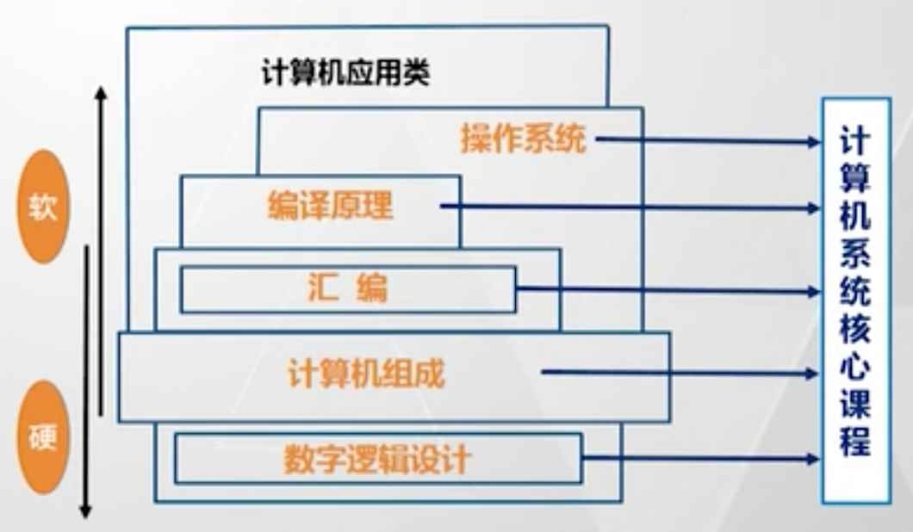
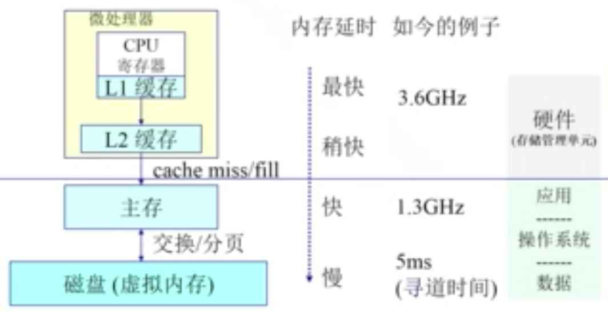

> 无论在任何行业、任何领域，所谓的“理解”，其实就是能透过现象看到本质。

计算机基础知识能帮我们了解计算机的本质、编程的本质。

我们为何一定要知道它的本质呢，又不是不能用？—— **因为只有了解了本质，这个东西才能是我们认知范围之内的，才不会让我们觉得有多神秘**。我们是这个行业的从业者，我们不应该觉得自己做的是一件很神秘的工作。

# 计算机组成原理

计算机就是一个电子设备，但为啥它能执行运算呢？基本原理是什么？

PS：了解基本原理并不等同于知道实现方案和细节。例如，我虽然造不出一个汽车发动机，但它的原理就是汽油燃烧带动气缸运动，它并不神秘。

## 是什么

计算机组成原理，一是讲解组成部分，而是讲解存储、运算的原理。

我们编写的代码最终要在计算机上运行，而运行的本质其实就是一个一个的算数或者逻辑运算。而计算机说到底是一个电子设备，计算机组成就是讲解这些算数、逻辑运算，是如何在电子设备上实现的，即讲解程序执行的最底层原理。其中主要包括：

- 计算机的主要组成部分：输入、输出、存储、控制、运算，以及他们的实现原理和依赖关系
- CPU 如何集结这些部分来完成运算

另外，计算机组成原理是计算机理论体系的第一门课，我们还要知道它和其他课程的关系。如下图

## 主要内容

计算机组成原理的内容非常多，都值得看一看。作为程序员，我列一下对我有帮助的内容。如有遗漏，欢迎各位[继续补充](https://github.com/wangfupeng1988/what-is-fe)。

### 冯.诺依曼 结构

图灵机是一个计算机的理论模型，而 冯.诺依曼 结构是图灵机的具体实现。冯.诺依曼 被誉为“现代计算机之父”。

“冯.诺依曼 结构”最核心的几个理念（现在大家习以为常，但在当时看来可能是颠覆性的）：

- 计算机的组成部分：运算器 控制器 存储器 输入设备 输出设备
- 程序和数据一样，被计算机存储起来，而不是靠人工插拔开关来控制程序，那样效率太低
- 内部计算使用二进制，而非十进制。其实此前有人设计出计算机使用十进制，不过很快就被淘汰了

### 使用二进制存储

计算机中所有的信息，无论是代码、数据、文档、视频等，在计算机中都是二进制格式的存在。

计算机为何“喜欢”二进制？这个应该很容易理解。计算机是一个电子设备，电路元件的最简单状态变化就是开关。通过电子元件的开关就可以表示 1 和 0 ，这样数据就能存储了，另外通过电子设备的开关控制电路就能很容易的实现逻辑运算，而二进制的所有算数运算，都可以通过逻辑运算来实现。这就是二进制在计算机中简单的原因。

### 算数运算和逻辑运算

无论你写的程序有多么庞大和复杂，最终计算机执行的时候就是一堆二进制数字，因此只要有算数运算和逻辑运算的能力，就能满足一起的计算需求。即，你能用编程语言写出来的所有逻辑，都可以转换为二进制的算数和逻辑运算。

继续。又因为是二进制存储，所以所有的算数运算都可以转换为逻辑运算。**即，二进制的算数运算，都可以转换为逻辑运算，重要！**

所以，这么一来，计算机在硬件层面只需要实现基本的逻辑运算，外加二进制格式存储，就能实现所有的计算要求。可以看出，复杂、强大的东西，背后的规则都是很简单的，否则它做不了那么强大。

基本逻辑运算有：

- “非”门
- “与”门（用“与非门”和“非门”相连以构成“与门”，因为“与非门”实现更加简单）
- “与非”门
- “或”门
- “异或”门（使用“与 或 非”组合出来）

### 存储器的区别

“冯.诺依曼结构”中指的存储器通常指内存，但是内存的访问速度远远低于 CPU ，因此现代计算机还有一个高速缓存机制。而且高速缓存也可能有多级，为何要用多级呢？—— 因为越是存取速度快的，成本越高。

所以，要综合考虑使用效率和制作成本，针对不同层级的应用，要使用不同的存储器。如果仅是考虑效率，最终设计出造价很高的计算机，也没人买得起。

## 如何学习

有一本同名的书《计算机组成原理》，很厚，看起来估计也会很枯燥，我没看过。

我看过一个视频教程[《计算机组成原理》](https://www.bilibili.com/video/av9647631/?p=1)（陆俊林，北京大学），感觉不错，推荐给大家。时长很长，一定要静下心来慢慢的看完。

# 操作系统

OS - 连接硬件和软件

## 是什么

如上图，这个模型应该都比较清楚，操作系统就是应用软件和计算机硬件的一个中间层，它具体需要做的内容如下：

- 对上层，要管理各个应用软件
    - 管理应用程序，如限制其占用太多内存
    - 为应用程序提供服务，如 IO 网卡 声卡等
    - 杀死应用程序
- 对下层，要管理计算机的各个硬件资源，**对其主要模块做抽象**（理解这一点很重要！），本文就围绕着这三个抽象来做总结。
    - CPU 抽象为进程、线程，以及调度
    - 物理内存抽象为逻辑内存、虚拟内存，并给各个应用程序提供独立的内存空间
    - 硬盘抽象为文件系统，通过文件即可管理硬盘的数据

操作系统的主要特点有：

- 并发：通过调度算法，让多个进程都能同时执行
- 共享：当多个进程同时访问同一数据时，进行管理（同时共享 或者 互斥共享）
- 虚拟：把硬件抽象，让每个应用程序都感觉自己是独占一台计算机，即把一台物理机器虚拟成多台机器

## 重要内容

操作系统最重要的就是对于硬件的抽象，即上文讲的对于 CPU、内存和硬盘的抽象。如有遗漏，欢迎各位[继续补充](https://github.com/wangfupeng1988/what-is-fe)。

### 进程、线程和调度算法

操作系统对于 CPU 的抽象。

#### 进程

进程，一个具有独立功能的程序在一个数据集合上动态执行的过程。一段代码编译出一个执行文件（在硬盘中），然后加载到内存中来执行，这个动态的执行过程就是进程。

PS：进程和我们日常所见的应用程序，并不是对等关系，如打开 chrome 会开启多个进程。

进程是操作系统管理的最小单元，操作系统会分配 CPU 资源，独立的内存资源（但一个进程被允许的最大可用内存空间是有限的）。而且操作系统会对多个进程分开管理，互不冲突，互不侵犯。

#### 线程

进程，开启之后由操作系统管理。

如果需要并发操作，是否一定需要开启多个进程呢？其实没必要。而且开启多个进程，会有以下问题：

- 如何共享数据，因为不同进程的数据是独立的（进程内存独立，互不侵犯）
- 维护进程的开销很大，PCB 包含了很多信息
- 进程切换，保存、恢复信息，开销也很大

进程内部，如果想要进行并发操作，就需要使用线程。线程也是操作系统提供的能力，但是并不会由操作系统直接管理，而是由进程内部的程序来管理，如用 java 开启多线程。

- 一个进程中的多个线程共同拥有内存空间（因此数据同步简单，不会受到 os 的干预）和代码
- 不同线程可以执行不同程序代码，有不同的堆、栈、寄存器，可并发执行
- 线程在进程内部，os 管理的是进程，却管不着线程，因此进程内部的线程要自己管理自己

不过线程也有不好的一面，因为多个线程共用一段内存空间，一旦一个线程崩溃出错，极有可能影响其他线程。

这就是为何 Chrome 为每一个网页都创建一个进程、而不是线程，因为你不能信任一个网页的稳定性，一旦一个网页奔溃，其他网页别受影响。当然，这还是得基于现代计算机内存空间和 CPU 性能的支持。

#### 调度算法

操作系统可以并发执行多个进程，如何保证多个进程都能正常有序的运行呢？并且 CPU 计算能力是有限的，但用户要开启的进程却不可限制。这就需要调度算法，来合理分配 CPU 在各个进程上的计算资源。

调度算法是 os 管理进程的核心算法，也是 os 是否强大的一个体现。这部分内容非常复杂，我们不用深入，了解个大概即可。

调度算法有：

- 先来先服务算法
- 短进程优先算法
- 最高响应比优先算法
- 轮询算法
- 多级反馈队列算法
- 等等……

### 内存管理

你买了一个电脑，硬件配置是 4G 内存的。电脑启动起来之后，打开 chrome ，该进程最多可以占 2G 内存。再打开一个游戏，该进程最多也可以占 2G 内存。操作系统本身还占一些内存空间，还有其他的例如 QQ 微信 PS 等。请思考：你这个电脑一共就 4G 内存，怎么能撑得起来那么多进程呢？—— 这就是操作系统对内存的管理。

硬件上的内存，不能直接暴露给 app 或者程序，要操作系统来管理它。所以，硬件的物理内存，就变成了操作系统的逻辑内存，然后给 app 或程序使用。试想一下，如果硬件的物理内存直接暴露给 app 和应用程序，第一会让程序开发变的非常复杂，第二内存使用乱套了，大家乱用毫无规则。

操作系统的逻辑内存，就提供便利、制定规则。特点是：

- 抽象：不关心物理，抽象为逻辑空间，编译开发者使用。
- 保护：每个进程独立地址空间，不相互破坏。微信不能去访问钉钉的内存空间。
- 共享：访问相同内存。
- 虚拟化：
    - 第一，虽然号称给 app 2G 的内存空间，但实际上是用多少给多少，而不是一下子给 2G ，否则就可能产生闲置和浪费。
    - 第二，虚拟的提供更多的内存空间，暂时不用的先放在硬盘上，再用的时候再到硬盘上去读取出来。
    - 所以上述案例，看似 4G 的内存，但可以支持很多程序同时开启。

### 文件系统和 I/O

待补充……

## 如何学习

书籍，网上有的是，大家找高分评价的来看就行了。

推荐一个视频教程[《操作系统》](https://www.bilibili.com/video/av6538245?from=search&seid=246032312215120374)（向勇、陈渝，清华大学）。时长很长，一定要静下心来慢慢的看完。

# 汇编语言

寄存器和内存

堆栈模型

CPU 指令（也可参考计算机组成部分）

# 编译原理

从高级语言到机器码

编译器流程

AST（将代码字符串结构化）

前端的应用（如 babel）

# 计算机网络

网络是怎么连接的

TCP/IP 协议

# 编码

二进制与编码

ASCII

unicode

utf-8
