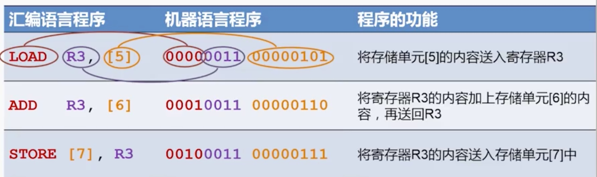

汇编语言，人类最早的编程语言，也是最贴近计算机底层的编程语言。你现在写任何逻辑性代码（如 C C++ java python js 等）最终都会转换成汇编语言来执行。

PS：本节只讲汇编语言，高级语言如何转换，可参考[编译原理](./编译原理.md)一节。

# 是什么

通过计算机组成原理，我们知道计算机内部的存储（无论是数据还是程序），都是二进制格式。程序是由一个一个的指令组成的，比如加法指令就是 `00000011` ，这些指令发送给 CPU 完成计算。

如果用二进制来编写程序，对于人来来说可读性太差了。能不能用一个已读一点的符号，来代替这一个一个的二进制指令呢？—— 这个就是汇编语言。简答来说，汇编语言就是机器语言（二进制代码）的助记符，是最早的语法糖。

例如下图，左侧是汇编语言，中间就是它所代表的二进制编码。可见，虽然汇编语言仅仅是一个语法糖，但是它对于人类编程来说，却具有巨大的意义。

## 高级语言的开发者，学习汇编有何用？

一句话总结就是：了解程序是在计算机中是如何被执行的，即透过现象（高级语言）看本质 —— 这是所有领域的技术人员都应该追求的东西。那些能随意在 php java js C++ 等语言中随意切换的程序猿大牛，我想他肯定熟知这个本质。

无论你日常编写的语言多么高级，肯定最终经过转换（编译原理的内容）然后生成汇编语言这种最底层的语言，再被计算机执行。而“执行”的本质，就可以通过汇编语言的一行一行代码看出：使用了哪个指令、获取了哪个内存地址、操作了哪个内存片段或者寄存器……

另外一个重要的部分就是程序执行的时候的内存模型。一段程序拿过来，哪些变量将被放在栈 stack ，哪些变量将被放在堆 heap ？以及这些内存空间如何被释放？甚至是你日常遇到的爆栈、内存泄露等问题，了解了内存模型，这些都会变的非常具象，不再懵。

# 重要内容

- 寄存器和内存模型
- 堆栈模型
- CPU 指令

推荐大家去阅读阮一峰的[汇编语言入门教程](http://www.ruanyifeng.com/blog/2018/01/assembly-language-primer.html) ，通俗易懂。

# 如何学习

同名的书，大家可以自己搜索买来读。

除了上文阮一峰的教程，还推荐大家去网上搜 **“汇编语言 张悠慧 清华大学”**，一个系列的视频教程。时长很长，需要耐心看完。
