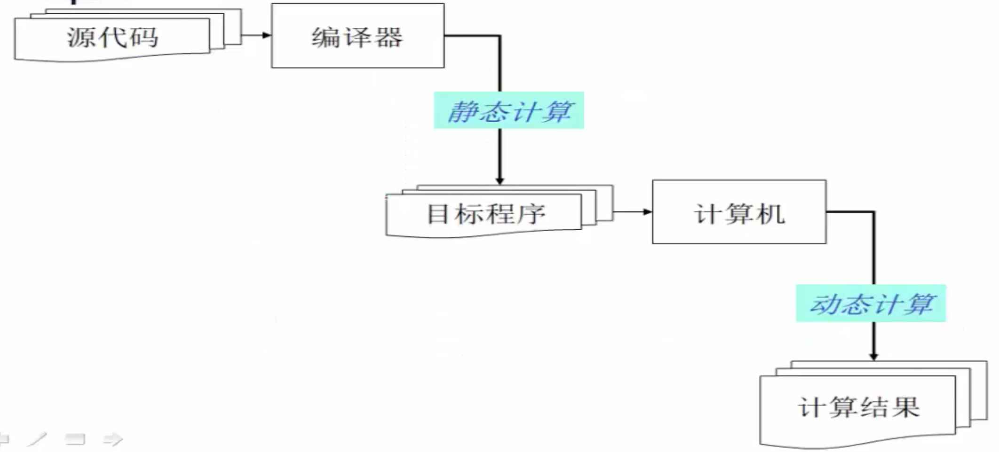
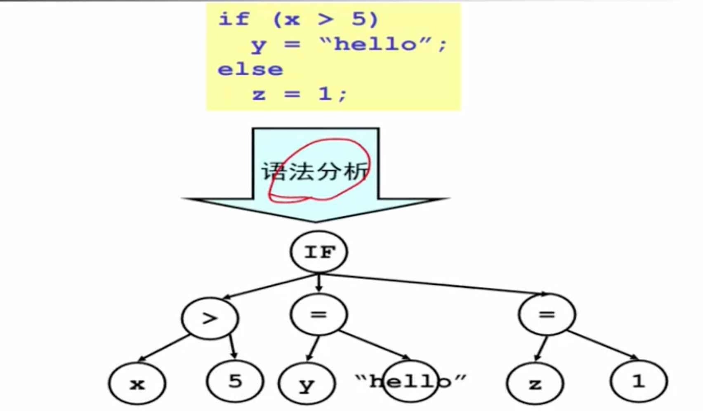

编译，才能让计算机能执行高级语言。

# 是什么

学过计算机组成原理和汇编语言，了解到计算机 CPU 执行的都是机器代码，汇编语言也仅仅是机器代码的语法糖。这些机器代码人类是很难读懂的。

那么，我们日常写的高级语言（C C++ java python js 等），我们人来读起来是越来越轻松了，但计算机如何识别并执行呢？—— 答案就是：将高级语言转换为汇编语言，然后计算机再执行。这个转换的过程，就是编译。

执行编译工作的，成为编译器。所以编译原理，也就是编译器的工作原理。编译器的基本定义是：将一门语言转换为另一门语言，一般指将高级语言转换为机器语言，但仅仅是转换并不执行。编译器最基本的底线，就是保证源代码和目标代码的语义相同。

## 编译器的工作流程

编译器的工作原理如上图，各个部分的解释：

- “源代码”是 C java 等高级语言，每种程序对应的编译器可能都不一样
- “静态计算”是指编译器只根据程序文本静态的分析（如做报错分析、优化分析），而不是真的拿 CPU 去执行
- 生成的“目标程序”可能是 x86 汇编（如对应 C 语言），也可能是 bytecode 字节码（如对应 java）
- “计算机”可能是一个 x86 的物理器（如对应 C 语言），也可能是 JVM java 虚拟机（如对应 java）。即不一定是一个真实的机器，可能是虚拟机，但这里都统称为“计算机”

## 编译器和解释器的区别

- 编译器：输入源代码，输出的一个可执行程序，但不去执行（存放在磁盘上等待被加载到内存中执行）
- 解释器：输入源代码，直接输出执行结果。其实 JVM 就是一个解释器，而不是一个单纯的编译器。输入 java 字节码 bytecode ，然后直接输出执行结果，而不是输出汇编代码。

# 重要内容

编译器的流程非常复杂，虽然都值得一看，但不要妄图自己一下子就理解所有。

## 抽象语法数 AST

AST - Abstract syntax tree 抽象语法树，这是编译过程中最重要的一个中间数据结构。

我们知道，计算机擅长处理结构化的数据，如数组、链表、树、图等，我们可以通过程序去访问、编译、修改这些数据结构。根据这些数据结构也有大量的可用算法。但是我们写的代码，却是像写作文一样，是一堆一堆的字符串，怎么看都不像是结构化的数据。如果一直都是非结构化的字符串，那交给计算机咋处理？计算机可不会阅读理解。

编译器首先把代码由字符串编程一个树，即 AST ，如下图。即如论你写的代码多复杂，只要语法规范，编译器都会编程一个内容相同的树，这个树可能会很庞大。

有了这个树，结构化的数据，计算机就可以继续处理。无论细节多复杂，但这一切都说得通了，没有什么神秘的了。

还有人专门做了可视化的网站 https://esprima.org/demo/parse.html ，大家可以试试，输入代码，生成 AST 。

## 前端的应用

如 babel 内部使用的 [babylon](https://www.npmjs.com/package/babylon) ，就是一个编译器，将 ES6 转换为 ES5 。

再例如，将 vue 的模板编译为 js 代码，将 React 中的 jsx 编译为 js 代码，这些过程虽然不能成为严格的编译器，但也用到了相似的流程。

# 如何学习

推荐一个视频教程，可搜索 **“编译原理 中科大 华保健老师”** ，时长较长，需耐心观看。
